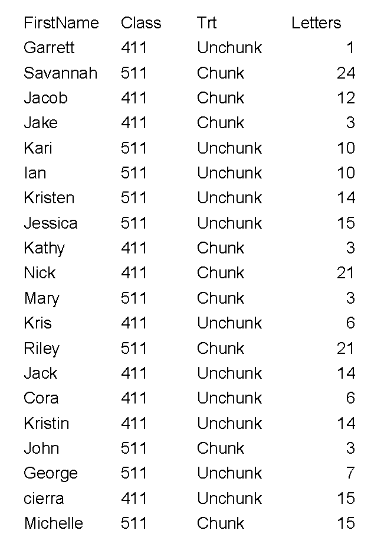

```{r setup, include=FALSE}
knitr::opts_chunk$set(echo = TRUE)
library(tidyverse)
library(MASS)
```

***Confidence Intervals for Randomization Tests and Permutation Tests***

```{r}
library(Sleuth3)
creative <- case0101
```

***Parametric Confidence Intervals***

First, for the purpose of comparison, we shall perform a *t*-test of the differences between groups and obtain the parametric 95 percent confidence interval.

This is the best way to determine what the order of subtraction is when doing a *t*-test in R. It takes the mean on the left minus the mean on the right. If we desire to interpret it in terms of the opposite direction, we must change the sign on the *t*-statistic. The *p*-value stays the same for a two-sided test while we subtract the *p*-value from one for the one-sided test. Lastly, we change the sign on the endpoints of the confidence interval and switch the order.

```{r}
t.test(creative$Score~creative$Treatment, var.equal=TRUE)
```

Based on the *t*-test, we have a 95 percent confidence interval for the difference between the intrinsic mean and the extrinsic mean of $(1.3, 7.0)$.

***Randomization Confidence Interval***

First, we need to perform the randomization test.

```{r}
# Calculate the test statistic
trt0 <- mean(creative$Score[creative$Treatment == "Intrinsic"]) - mean(creative$Score[creative$Treatment == "Extrinsic"])
cat("Observed t0 = ", trt0, "\n")
# Set random seed for purposes of replication
set.seed(12345)
# Randomly shuffle labels and recalculate treatment effect
trt.est = NULL
for(i in 1:10000){
  shuffle_group <- creative$Treatment[sample(47)]
  trt.est[i] <- mean(creative$Score[shuffle_group == "Intrinsic"] - mean(creative$Score[shuffle_group == "Extrinsic"]))
}
summary(trt.est)
```

Determine how this randomization distribution relates to our null hypothesis.

```{r}
hist(trt.est)
abline(v = trt0, col = "red", lwd=2)
abline(v = -trt0, col = "red", lwd=2)
```

Computing the *p*-value

```{r}
mean(trt.est <= -trt0 | trt.est >= trt0)
```

***Changing the Null Value***

Utilizing a null hypothesis of a difference of five points (the difference between the intrinsic mean and the extrinsic mean) adds an additional step to setting up the randomization test.

```{r}
new.score <- creative$Score
new.score[creative$Treatment == "Intrinsic"] <- creative$Score[creative$Treatment == "Intrinsic"]-5
```

We subtract the null value of five from the intrinsic group so that the expected difference under the null is still zero. Once we have done this, we can repeat the randomization test on the shifted data.

$H_{0}: \mu_{I}-\mu_{E}=5$ implies that $H_{0}: (\mu_{I}-5)-\mu_{E}=0$ and $H_{0}: \mu_{I}-5=\mu_{E}$.

```{r}
# Calculate our test statistic under this new null hypothesis
trt <- mean(new.score[creative$Treatment == "Intrinsic"]) - mean(new.score[creative$Treatment == "Extrinsic"])
cat("Observed t0 = ", trt0, "\n")
# Perform randomization test under this new null hypothesis
trt.est = NULL
for (i in 1:10000){
  shuffle_group <- creative$Treatment[sample(47)]
  trt.est[i] <- mean(new.score[shuffle_group == "Intrinsic"]) - mean(new.score[shuffle_group == "Extrinsic"])
}
summary(trt.est)

hist(trt.est)
abline(v= trt0, col = "red", lwd=2)
abline(v = -trt0, col = "red", lwd=2)

mean(trt.est <= -trt0 | trt.est >= trt0)
```

***Function to obtain the *p*-value under a given null hypothesis***

```{r}
randCIp <- function(delta){
  new.score = creative$Score
  new.score[creative$Treatment == "Intrinsic"] <- creative$Score[creative$Treatment == "Intrinsic"]-delta
  trt0 <- mean(new.score[creative$Treatment == "Intrinsic"]) - mean(new.score[creative$Treatment == "Extrinsic"])
  trt.est = NULL
  for(i in 1:10000){
    shuffle_group <- creative$Treatment[sample(47)]
    trt.est[i] <- mean(new.score[shuffle_group == "Intrinsic"]) - mean(new.score[shuffle_group == "Extrinsic"])
  }
  return(mean(trt.est <= -abs(trt0) | trt.est >= abs(trt0)))
}

randCIp(-4)
randCIp(4)
randCIp(2)
```

***Function to evaluate whether given null is in the interval***

```{r}
randCIsearch <- function(delta, conf.level = 0.95){
  abs(randCIp(delta)-(1-conf.level))
}

optimize(randCIsearch, interval = c(-4,4))
randCIp(1.27)
randCIp(1.25)
optimize(randCIsearch, interval = c(4,10))
```

If the randomization-based *p*-value is very small, this algorithm may have trouble finding one of the bounds. If you obtain a small *p*-value and an enormous interval, you may need to play around with the specification of the bounds in the optimization function or the number of iterations in each randomization.

```{r}
randCIp <- function(delta, treatment, outcome, reference){
  new.score <- outcome
  new.score[treatment == reference] <- outcome[treatment == reference]-delta
  trt0 <- mean(new.score[treatment == reference]) - mean(new.score[treatment != reference])
  trt.est = NULL
  for(i in 1:10000){
    shuffle_group <- treatment[sample(length(treatment))]
    trt.est[i] <- mean(new.score[shuffle_group == reference]) - mean(new.score[shuffle_group != reference])
  }
  return(mean(trt.est <= -abs(trt0) | trt.est >= abs(trt0)))
}

randCIsearch <- function(delta, conf.level, treatment, outcome, reference){
  abs(randCIp(delta, treatment, outcome, reference)-(1-conf.level))
}

FindInterval <- function(treatment, outcome, reference, conf.level = 0.95){
  trt0 <- mean(outcome[treatment == reference]) - mean(outcome[treatment != reference])
  
  trt.est = NULL
  for (i in 1:10000){
    shuffle_group <- treatment[sample(length(treatment))]
    trt.est[i] <- mean(outcome[shuffle_group == reference]) - mean(outcome[shuffle_group != reference])
  }
  lower.bound <- optimize(randCIsearch, interval = c(min(trt.est)-abs(trt0), trt0), conf.level, treatment, outcome, reference)$minimum
  upper.bound <- optimize(randCIsearch, interval = c(trt0, max(trt.est)+abs(trt0)), conf.level, treatment, outcome, reference)$minimum
  return(list(lower = lower.bound, upper = upper.bound))
}

FindInterval(creative$Treatment, creative$Score, reference = "Intrinsic", conf.level = 0.95)
```

***Memorizing Letters***



***Inference for a Single Mean***

```{r, echo=FALSE, message=FALSE}
library(readxl)
MemorizeLetters <- read_excel("MemorizingLettersData.xlsx", col_names=TRUE)

mean(MemorizeLetters$Letters)
sd(MemorizeLetters$Letters)
```

***Inference for a Single Mean***

```{r}
t.test(MemorizeLetters$Letters, alternative = "greater", mu = 3, conf.level = 0.95)
```

***Inference for Difference Between Two Means (Independent Samples)***

```{r}
tapply(MemorizeLetters$Letters, MemorizeLetters$Trt, mean)
tapply(MemorizeLetters$Letters, MemorizeLetters$Trt, sd)

t.test(MemorizeLetters$Letters[MemorizeLetters$Trt == "Chunk"], 
       MemorizeLetters$Letters[MemorizeLetters$Trt == "Unchunk"], 
       alternative = "greater", mu = 0, conf.level = 0.95, var.equal=TRUE)

tapply(MemorizeLetters$Letters, MemorizeLetters$Class, mean)
tapply(MemorizeLetters$Letters, MemorizeLetters$Class, sd)

t.test(MemorizeLetters$Letters[MemorizeLetters$Class == "511"], 
       MemorizeLetters$Letters[MemorizeLetters$Class == "411"], 
       alternative = "two.sided", mu = 0, conf.level = 0.95, var.equal=TRUE)

set.seed(58923)
rs.mean <- c()
for(i in 1:5000){
  MemorizeLetters$resampled.score <- sample(MemorizeLetters$Letters)
  rs.mean[i] <- mean(MemorizeLetters$resampled.score[MemorizeLetters$Class=="511"]) - mean(MemorizeLetters$resampled.score[MemorizeLetters$Class=="411"])
}
sum(rs.mean >= 2.7 | rs.mean <= -2.7)/5000
```

We will be exploring a data set provided in R libary that is known as **MASS**. The data come from a study of three methods to treatment female anorexia patients, which are known as the control method, the cognitive behavioral therapy method, and the family therapy method. There are 72 observations of three variables.

```{r}
summary(anorexia)
WeightChange <- anorexia$Postwt <- anorexia$Prewt
t.test(WeightChange)
t.test(anorexia$Postwt, anorexia$Prewt, paired=TRUE)
t.test(anorexia$Postwt, anorexia$Prewt)

sd(WeightChange)/sqrt(72)
sqrt(var(anorexia$Postwt) + var(anorexia$Prewt))*sqrt(1/72+1/72)

t.test(WeightChange, alternative="greater")
t.test(WeightChange, mu=-1)

ano2 <- anorexia %>%
  mutate(WeightChange = Postwt-Prewt)
ano2 %>% {t.test(.$WeightChange)}

CBTcon <- anorexia[anorexia$Treat == "CBT" | anorexia$Treat == "Cont",]
CBTcon$WeightChange <- CBTcon$Postwt - CBTcon$Prewt
t.test(WeightChange~Treat, data=CBTcon, var.equal=TRUE)
```

