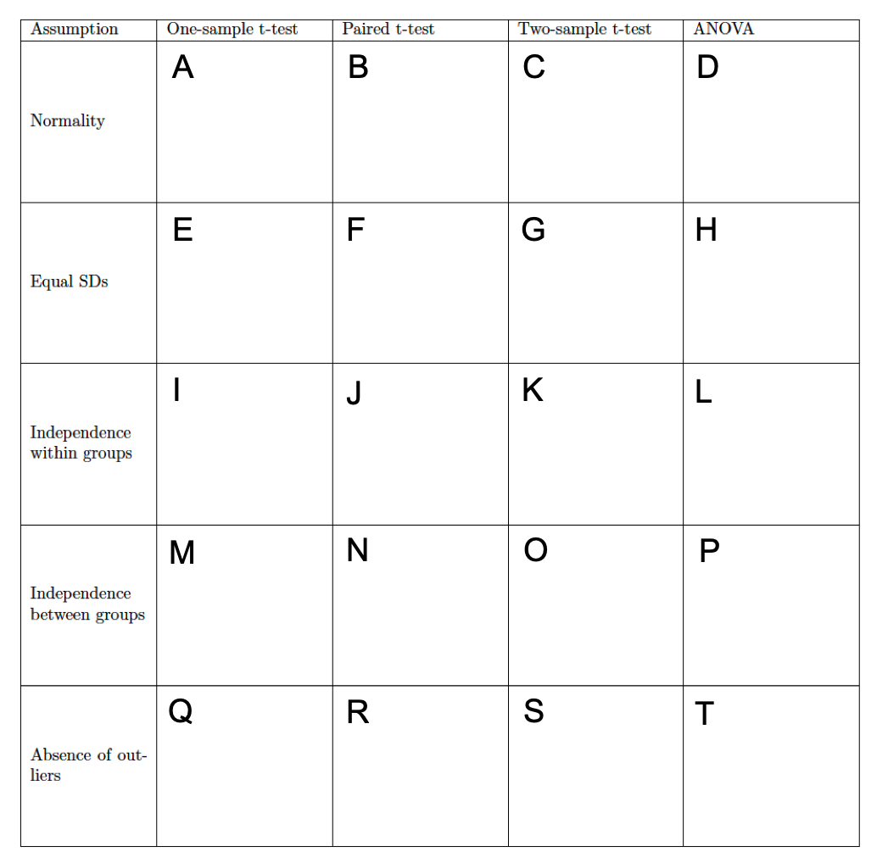
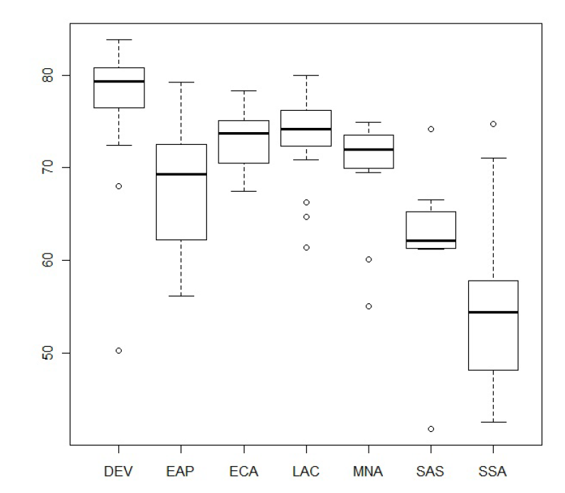

***Sampling Question [2 Points]***

Suppose researchers desire to estimate the stress response in an unfamiliar situation for children who have a twin. Assume that 100 children (50 pairs of twins) constitute the available population and that the researchers can administer the test to 30 children. Each time the researchers choose a child at random, they also select the twin sibling of that child. By utilizing this procedure, determine whether the researchers obtain a simple random sample of children who have a twin brother or sister. Explain your reasoning.

Out of the 100 children that constitute the population, the researchers select 30 children at random without replacement. When they randomly select a child, they also select the twin sibling of that child. This is equivalent to randomly selecting 15 pairs of twins out of 50 total pairs of twins. Because the researchers randomly a select a child (and by extension, randomly select a given pair of twins), and also because each member of the given population has an equal probability of being selected, independent of which other members are selected, the researchers definitely obtained a simple random sample of children who have a twin brother or sister.

***Model Selection Question [5 Points]***

A study was undertaken to determine different sources of stress among college students. A sample of 1,000 college students was asked to rate different potential sources of stress such as parents, roommates, partners, and final examinations. They were also asked to provide demographic information, including number of enrolled credits, whether they are the first in their family to attend college, and geographic origin (in-state, out-of-state, international). For each of the following questions relative to this data set, select the appropriate statistical procedure. Your options are the one-sided, one sample \emph{t}-test, the two-sided, one sample \emph{t}-test, the one-sided, two sample \emph{t}-test, the two-sided, two sample \emph{t}-test, the one-sided, paired \emph{t}-test, the two-sided, paired \emph{t}-test, or the ANOVA test.

The first question asks whether undergraduates at large urban universities are more stressed by their parents or their roommates.

The appropriate statistical procedure for the first question is the one-sided, paired \emph{t}-test.

The second question asks whether there are differences in the stress levels due to final examinations between those who are the first in their family to attend college and those who are not.

The appropriate statistical procedure for the second question is the two-sided, two sample \emph{t}-test.

The third question asks whether undergraduates at large urban universities typically take 15 credits per semester.

The appropriate statistical procedure for the third question is the two-sided, one sample \emph{t}-test.

The fourth question asks whether there are differences in stress level due to roommates by geographic origin.

The appropriate statistical procedure for the fourth question is the ANOVA test.

The fifth questions asks whether, among undergraduates at large urban universities, first-generation students are more stressed by their parents than their peers are stressed by their parents.

The appropriate statistical procedure for the fifth question is the one-sided, paired \emph{t}-test.

***Model Assumption Question [14 Points]***

For each of the main methods that have been discussed, indicate whether the assumption is formulated by each approach and if the assumption is formulated, whether or not the method is robust to violations of that assumption. All answers should be short answers.



***Normality***

For A, the assumption is formulated and the method is robust to violations of the assumption.

For B, the assumption is formulated and the method is robust to violations of the assumption.

For C, the assumption is formulated and the method is robust to violations of the assumption.

For D, the assumption is formulated and the method is robust to violations of the assumption.

***Equal Standard Deviations***

For E, whether the assumption is formulated and the method is not robust to violations of the assumption is not considered to be applicable since there is only one group.

For F, the assumption is formulated and the method is not robust to violations of the assumption.

For G, the assumption is formulated and the method is not robust to violations of the assumption.

For H, the assumption is formulated and the method is not robust to violations of the assumption.

***Independence Within Groups***

For I, the assumption is formulated and the method is not robust to violations of the assumption.

For J, the assumption is formulated and the method is not robust to violations of the assumption.

For K, the assumption is formulated and the method is not robust to violations of the assumption.

For L, the assumption is formulated and the method is not robust to violations of the assumption.

***Independence Between Groups***

For M, whether the assumption is formulated and the method is not robust to violations of the assumption is not considered to be applicable since there is only one group.

For N, the assumption is not formulated and the method is not robust to violations of the assumption.

For O, the assumption is formulated and the method is not robust to violations of the assumption.

For P, the assumption is formulated and the method is not robust to violations of the assumption.

***Resistance to Outliers***

For Q, the assumption is formulated and the method is not robust to violations of the assumption.

For R, the assumption is formulated and the method is not robust to violations of the assumption.

For S, the assumption is formulated and the method is not robust to violations of the assumption.

For T, the assumption is formulated and the method is not robust to violations of the assumption.

Determine what tools you would utilize to evaluate the appropriateness of each assumption. If you utilize a plot, state the name of the plot(s) that you would utilize and what you would look for.

Normality: In order to evaluate the degree to which the normality assumption is appropriate, we utilize the Q-Q plot, the box plot, or the histogram. For the histogram, the distribution should be symmetric and the plot should be roughly normal in shape. For the Q-Q plot, points should lie close to the line and there should be no clear pattern of deviation. For the box plot, the median should be roughly centered in the box and whiskers should be approximately of equal length.

Equal Variances: In order to evaluate the degree to which the equal variances assumption is appropriate, we utilize side-by-side box plots to compare the standard deviations for the box plot of the original data set and the box plot of the logarithmically transformed data set.

Independence: In order to evaluate the degree to which the independence assumption is appropriate, we utilize the knowledge of how the data were collected.

Absence of Outliers: In order to evaluate the degree to which it is appropriate to assume that there are no outliers, the tool that we utilize is logarithmic transformation of the data. In so doing, we determine whether there are outliers in data, and whether those outliers have a significant effect on the data. However, logarithmic transformation is applied to quantile-quantile plots, box plots, bean plots, residual versus fitted plots, and leverage plots.

***Reading Plots Question [4 Points]***

Below we have the distribution of female life expectancy by region, taken from data collected by the World Bank. The World Bank gives the following regions for developing countries: East Asia \& Pacific (EAP), Europe \& Central Asia (ECA), Latin America \& Caribbean (LCA), Middle East \& North Africa (MNA), South Asia (SAS), and Sub-Saharan Africa (SSA). Developed countries are grouped together under DEV.




Determine which region has the single lowest value for female life expectancy.

The region known as South Asia (SAS) has the single lowest value in life expectancy, as indicated by the outlier in the data set that is even less than the minimum for the Sub-Saharan Africa (SSA) data set.

Determine which region has the highest overall life expectancies.

The region highest overall life expectancies is the region comprised of developed countries.

Determine which region has the smallest spread.

The region with the smallest spread is the Europe \& Central Asia (ECA) region.

Based on this plot, determine whether any of the ANOVA assumptions are violated here.

The ANOVA assumptions that are violated here are normal distribution assumption because the normality is not very adequate, the outlier assumption because there are many outliers, the independence assumption because of unknown independence information, and the equal variance assumption because there is no equal variance.

***Study Design Questions [10 Points]***

Determine the difference between random sampling and random assignment. [2 Points]

In random sampling, units are selected by the investigator from a well-defined population by utilizing chance mechanisms. In random assignment, chance mechanisms are utilized to assign different treatment levels to the randomly sampled units.

A study revealed that children who watch more than two hours of television each day tend to have higher cholesterol levels than children who watch less than two hours of television each day. Determine whether this proves that watching television causes high cholesterol. Identify a likely confounding factor. [4 Points]

It cannot proven that watching television causes high cholesterol. First, this is an observational study because the units are not being assigned to treatment groups. The study only revealed the difference in cholesterol levels between children who watch less than two hours of television each day versus children who watch more than two hours of television per day. Because there was no element of random assignment, we cannot imply a causal relationship between watching television and high cholesterol levels. Furthermore, the study never explicitly stated that the children were randomly sampled from a larger population. Therefore, even if this was an experiment, the scope of inference would only extend to children and not everyone, which contradicts the idea that, in general, watching television causes high cholesterol. Ultimately, based on the study, there it at best an non-causal association between watching television and cholesterol levels for children. However, such a non-causal association is undermined by such confounding factors as the nutrition regimens of the children being studied, what they watch on television, or their socioeconomic status.

A number of volunteers were randomly assigned to one of two groups, one of which received daily doses of ascorbic acid and one of which received daily placebos. It was found that the rate at which common colds were contracted was lower in the ascorbic acid group than in the placebo group. It became evident, however, that many of the subjects in the ascorbic acid group correctly guessed that they were receiving ascorbic acid rather than placebo based on the gustatory sensation. Determine whether it can still be said that the difference in treatments is what caused the difference in rates at which common colds were contracted. Explain. [4 Points]

It was explicitly stated that the volunteers were randomly assigned to two treatment groups. This means that we can indicate a causal relationship between the rate at which common colds were contracted and the difference in treatments. Furthermore, because the objective is to determine that the difference in treatments is what caused the difference in rate at which common colds were contracted, it can be assumed that the scope of inference only extends to those who were assigned to the treatment groups, which would be logical given that it was not explicitly stated that there was an element of random sampling. It also was not stated that those in the placebo group correctly guessed that they were receiving a placebo. Ultimately, while we can infer a causal relationship between the explanatory variable and the response variable, such a relationship is undermined by the fact that the the subjects were not blinded to the treatments. We cannot say that the difference in treatments caused the difference in rates at which common colds were contracted.

Researchers are interested in investigating differences in reaction times between individuals who drink coffee and individuals who drink water before taking a reaction test. They plan to choose 20 individuals who drink water and 20 individuals who drink coffee one hour before taking a reaction test. If the researchers plan to formulate a causal inference, the individuals who were sampled must be randomly assigned to different treatment groups such that which reaction test is taken is not determined by the beverage that someone drinks. [2 Points].

***R Coding Question 1 [16 Points]***

Data were collected on the prices per pound (in cents) received by fishermen and vessel owners for various species of fish and shellfish in 1970 and 1980. You will evaluate whether there is evidence for a difference in prices between the two years.

Give an appropriate descriptive statistical summary and provide plots for the prices. [4 Points]

```{r}
fish <- read.csv("fishPrices.csv")
summary(fish)

par(mfrow = c(1,2))
boxplot(Price_1970, Price_1980)
plot(Price_1970, Price_1980)
```

Determine what method you would utilize to analyze these data. [2 Points]

To analyze the data, I would utilize a paired \emph{t}-test.

Evaluate the assumptions of your chosen method for these data. Explain how you would deal with any violations. Give additional descriptions and plots if needed. If there are violations, explain how you would deal with them. [4 Points]

```{r}
hist(Price_1980-Price_1970, main="Difference Between Annual Prices")
hist(log(Price_1980)-log(Price_1970), main="Logarithmic Transformation of Difference Between Annual Prices")
```

Given that the histogram exhibiting the un-transformed difference of the data is skewed, thereby violating normality assumptions, the solution is to logarithmically transform the annual prices and then calculate the difference.

Give the code to implement the analysis and the output produced. [2 Points]

```{r}
t.test(log(Price_1980), log(Price_1970), paired=T)
```

Utilizing your responses above, in one to two sentences, write a paragraph that summarizes the results for your findings. [4 Points]

Because the reported \emph{p}-value is less than $\alpha=0.05$, we have sufficient evidence to reject the null hypothesis and conclude that the difference in prices between the two years. Because it is not explicitly stated that the prices were randomly sampled and because this was not an experiment where units were assigned to treatment group, the scope of inference for this study is an association between the price of fish and the year in which fish were collected only for this sample of prices.

***R Coding Question 2 [35 Points]***

Stock automobiles contain crash test mannequins in the driver and front passenger seats crashed into a wall at 56.322 kilometers per hour. National Transportation Safety Board officials collected information about how the crash affected the mannequins. The injury variables describe the extent of head injuries, chest deceleration, and left and right femur load. The data file also contains information on the type and safety features of each crashed automobile.

We will focus on the type of protection the automobile offered and whether the mannequin is in the driver or passenger seat as treatments and head injury and right leg injury as outcomes.

```{r}
crash <- read.csv("crash.csv")
attach(crash)
summary(crash)
```

Create a combined treatment group variable that indicates both the type of protection and whether the mannequin was in the driver seat, and provide a tabulation of your results. [3 Points]

```{r}
treatment <- paste(D.P, Protection, sep="-")
table(treatment)
```

Plot the outcomes by the combined treatment and the two individual treatments. Determine whether you note any potential violations of assumptions and explain your reasoning. If so, transform the data and see if your assumptions are more appropriate. [8 Points]

```{r}
par(mfrow=c(2,3))

boxplot(Head.IC~treatment)
boxplot(Head.IC~Protection)
boxplot(Head.IC~D.P)

boxplot(R.Leg~treatment)
boxplot(R.Leg~Protection)
boxplot(R.Leg~D.P)
```

The plots of the outcomes by the combined treatment and the two individual treatments appears to violate the equal variance assumption and possibly the normality assumption. The solution is to apply logarithmic transformation for improved results.

```{r}
par(mfrow=c(2,3))
boxplot(log(Head.IC)~treatment)
boxplot(log(Head.IC)~Protection)
boxplot(log(Head.IC)~D.P)

boxplot(log(R.Leg)~treatment)
boxplot(log(R.Leg)~Protection)
boxplot(log(R.Leg)~D.P)
```

Now fit individual ANOVA tests for each pairing of treatment(s) and outcomes, and evaluate whether they suggest evidence for differences in injury severity by treatment. [4 Points]

```{r}
# Natural Scale
fit.dp.H <- aov(Head.IC~D.P)
summary(fit.dp.H)

fit.dp.L <- aov(R.Leg~D.P)
summary(fit.dp.L)

fit.pro.H <- aov(Head.IC~Protection)
summary(fit.pro.H)

fit.pro.L <- aov(R.Leg~Protection)
summary(fit.pro.L)

fit.trt.H <- aov(Head.IC~treatment)
summary(fit.trt.H)

fit.trt.L <- aov(R.Leg~treatment)
summary(fit.trt.L)

# Logarithmic Scale
log.dp.H <- aov(log(Head.IC)~D.P)
summary(log.dp.H)

log.dp.L <- aov(log(R.Leg)~D.P)
summary(log.dp.L)

log.pro.H <- aov(log(Head.IC)~Protection)
summary(log.pro.H)

log.pro.L <- aov(log(R.Leg)~Protection)
summary(log.pro.L)

log.trt.H <- aov(log(Head.IC)~treatment)
summary(log.trt.H)

log.trt.L <- aov(log(R.Leg)~treatment)
summary(log.trt.L)
```

Based on fact that the \emph{p}-values that were obtained for the individual ANOVA tests for each pairing of treatment(s) and outcomes were all less than $\alpha=0.05$, there exists strong evidence to suggest that there are differences in injury severity by treatment.

Utilize a nested ANOVA test to evaluate whether the combined treatment group from the first question is a better predictor of injury severity than either the type of protection or the seat of the crash test mannequin. [4 Points]

```{r}
# Natural Scale
anova(fit.pro.H, fit.trt.H)

anova(fit.pro.L, fit.trt.L)

anova(fit.dp.H, fit.trt.H)

anova(fit.dp.L, fit.trt.L)

# Logarithmic Scale

anova(log.pro.H, log.trt.H)

anova(log.pro.L, log.trt.L)

anova(log.dp.H, log.trt.H)

anova(log.dp.L, log.trt.L)
```

Utilize contrasts based on the full model to evaluate differences between the driver seat and the passenger seat, airbags versus seat belts, the airbag of the driver seat versus the airbags of the driver seat and the passenger seat. Provide your code and output. [6 Points]

```{r}
# Natural Scale Results
gpmeans <- tapply(Head.IC, treatment,mean, na.rm = T)
n.vec <- table(treatment)

# Head Injury (Airbag Versus Belts)
c.vec <- c(0.25, 0.25, -1/6, -1/6, -1/6, 0.25, 0.25, -1/6, -1/6, -1/6)
c.coef <- sum(c.vec*gpmeans)
c.sd <- sqrt(185469)*sqrt(sum((c.vec^2)/n.vec))
c.coef

c.coef - qt(0.975, length(treatment)-10)*c.sd

c.coef + qt(0.975, length(treatment)-10)*c.sd

pt(c.coef/c.sd, length(treatment)-10)

# Head Injury (Driver Versus Passenger)
c.vec <- c(0.2, 0.2, 0.2, 0.2, 0.2, -0.2, -0.2, -0.2, -0.2, -0.2)
c.coef <- sum(c.vec*gpmeans)
c.sd <- sqrt(185469)*sqrt(sum((c.vec^2)/n.vec))
c.coef

c.coef - qt(0.975, length(treatment)-10)*c.sd

c.coef + qt(0.975, length(treatment)-10)*c.sd

1-pt(c.coef/c.sd, length(treatment)-10)

# Head Injury (Driver Versus Passenger Airbags)
c.vec <- c(0.5, -0.5, 0, 0, 0, 0.5, -0.5, 0, 0, 0)
c.coef <- sum(c.vec*gpmeans)
c.sd <- sqrt(185469)*sqrt(sum((c.vec^2)/n.vec))
c.coef

c.coef - qt(0.975, length(treatment)-10)*c.sd

c.coef + qt(0.975, length(treatment)-10)*c.sd

1-pt(c.coef/c.sd, length(treatment)-10)

# Leg Injury (Airbag Versus Belts)
gpmeans <- tapply(R.Leg, treatment,mean, na.rm = T)
n.vec <- table(treatment)

c.vec <- c(0.25, 0.25, -1/6, -1/6, -1/6, 0.25, 0.25, -1/6, -1/6, -1/6)
c.coef <- sum(c.vec*gpmeans)
c.sd <- sqrt(155145)*sqrt(sum((c.vec^2)/n.vec))
c.coef

c.coef - qt(0.975, length(treatment)-10)*c.sd

c.coef + qt(0.975, length(treatment)-10)*c.sd

pt(c.coef/c.sd, length(treatment)-10)

# Leg Injury (Driver Versus Passenger)
c.vec <- c(0.2, 0.2, 0.2, 0.2, 0.2, -0.2, -0.2, -0.2, -0.2, -0.2)
c.coef <- sum(c.vec*gpmeans)
c.sd <- sqrt(155145)*sqrt(sum((c.vec^2)/n.vec))
c.coef

c.coef - qt(0.975, length(treatment)-10)*c.sd

c.coef + qt(0.975, length(treatment)-10)*c.sd

1-pt(c.coef/c.sd, length(treatment)-10)

# Leg Injury (Driver Versus Passenger Airbags)
c.vec <- c(0.5, -0.5, 0, 0, 0, 0.5, -0.5, 0, 0, 0)
c.coef <- sum(c.vec*gpmeans)
c.sd <- sqrt(155145)*sqrt(sum((c.vec^2)/n.vec))
c.coef

c.coef - qt(0.975, length(treatment)-10)*c.sd

c.coef + qt(0.975, length(treatment)-10)*c.sd

pt(c.coef/c.sd, length(treatment)-10)

# Logarithmic Scale Results
gpmeans <- tapply(log(Head.IC), treatment,mean, na.rm = T)
n.vec <- table(treatment)

# Head Injury (Airbag Versus Belts)
c.vec <- c(0.25, 0.25, -1/6, -1/6, -1/6, 0.25, 0.25, -1/6, -1/6, -1/6)
c.coef <- sum(c.vec*gpmeans)
c.sd <- sqrt(0.1842)*sqrt(sum((c.vec^2)/n.vec))
c.coef

c.coef - qt(0.975, length(treatment)-10)*c.sd

c.coef + qt(0.975, length(treatment)-10)*c.sd

pt(c.coef/c.sd, length(treatment)-10)

# Head Injury (Driver Versus Passenger)
c.vec <- c(0.2, 0.2, 0.2, 0.2, 0.2, -0.2, -0.2, -0.2, -0.2, -0.2)
c.coef <- sum(c.vec*gpmeans)
c.sd <- sqrt(0.1842)*sqrt(sum((c.vec^2)/n.vec))
c.coef

c.coef - qt(0.975, length(treatment)-10)*c.sd

c.coef + qt(0.975, length(treatment)-10)*c.sd

1-pt(c.coef/c.sd, length(treatment)-10)

# Head Injury (Driver Versus Passenger Airbags)
c.vec <- c(0.5, -0.5, 0, 0, 0, 0.5, -0.5, 0, 0, 0)
c.coef <- sum(c.vec*gpmeans)
c.sd <- sqrt(0.1842)*sqrt(sum((c.vec^2)/n.vec))
c.coef

c.coef - qt(0.975, length(treatment)-10)*c.sd

c.coef + qt(0.975, length(treatment)-10)*c.sd

1-pt(c.coef/c.sd, length(treatment)-10)

# Leg Injury (Airbag Versus Belts)
gpmeans <- tapply(log(R.Leg), treatment,mean, na.rm = T)
n.vec <- table(treatment)

c.vec <- c(0.25, 0.25, -1/6, -1/6, -1/6, 0.25, 0.25, -1/6, -1/6, -1/6)
c.coef <- sum(c.vec*gpmeans)
c.sd <- sqrt(0.2809)*sqrt(sum((c.vec^2)/n.vec))
c.coef

c.coef - qt(0.975, length(treatment)-10)*c.sd

c.coef + qt(0.975, length(treatment)-10)*c.sd

pt(c.coef/c.sd, length(treatment)-10)

# Leg Injury (Driver Versus Passenger)
c.vec <- c(0.2, 0.2, 0.2, 0.2, 0.2, -0.2, -0.2, -0.2, -0.2, -0.2)
c.coef <- sum(c.vec*gpmeans)
c.sd <- sqrt(0.2809)*sqrt(sum((c.vec^2)/n.vec))
c.coef

c.coef - qt(0.975, length(treatment)-10)*c.sd

c.coef + qt(0.975, length(treatment)-10)*c.sd

1-pt(c.coef/c.sd, length(treatment)-10)

# Leg Injury (Driver Versus Passenger Airbags)
c.vec <- c(0.5, -0.5, 0, 0, 0, 0.5, -0.5, 0, 0, 0)
c.coef <- sum(c.vec*gpmeans)
c.sd <- sqrt(0.2809)*sqrt(sum((c.vec^2)/n.vec))
c.coef

c.coef - qt(0.975, length(treatment)-10)*c.sd

c.coef + qt(0.975, length(treatment)-10)*c.sd

pt(c.coef/c.sd, length(treatment)-10)
```

Utilizing your responses above, write a statistical report of your findings that is approximately two pages long. [10 Points]

***Introduction***

Automobiles are exceedingly dangerous. In fact, they can be considered so dangerous that more deaths are attributed to driving than flying. It is because automobiles are dangerous that automobile manufacturers test automobiles with crash test mannequins to account for how a human body could be injured and how safety features and the overall construction of a given automobile can protect against injury. Because much data is generated in order to ascertain that automobiles are engineered for as much safety as possible, there exists a wide variety of statistical studies that can help reach very important conclusions.

The goal of this study, which utilized data collected by the National Transportation Safety Board, was to determine whether there is a difference between the mean of the injury severity prediction for which seat the mannequins were sitting in and the mean of the injury severity prediction for the different types of safety protection that were featured in the automobiles being examined. Injury severity prediction was quantitatively measured with right femur load data and head injury data.

***Methods***

To determine whether there is a difference between the mean of the injury severity prediction for which seat the mannequins were sitting in and the mean of the injury severity prediction for the different types of safety protection that were featured in the automobiles being examined, the first step was to isolate the right femur load data and the head injury data for our two categorical variables, and then separate them based on passenger seat or driver seat for where the mannequin was seated or based on the five different safety features that were utilized for protection. In so doing, the means and standard deviations for the two seating arrangements and the five safety features were elucidated for purposes of clarity.

Next, individual ANOVA tests were applied to determine the differences in means for head injury data among safety features for protection, head injury data among seating arrangements, right femur load data among safety features for protection, and right femur load data among seating arrangements. Next, two nested ANOVA tests were applied to analyze the difference in means between head injury data among safety features for protection and head injury data among seating arrangements as well as analyze the difference in means between right femur load data among safety features for protection and head injury data among seating arrangements. Lastly, the contrasts for were calculated for the four individual treatment groups by hand. However, a linear combination of means could not be applied due to the size of the data set. Though this observational study had limitations as to what could be analyzed, it served its purpose.

***Results***

Four individual ANOVA tests were conducted to compare the different groups that comprised the categorical features of driver seat versus passenger seat and the five different types of safety features that were utilized for protection. The reported \emph{p} value for the head injury data as an outcome of the five different types of safety features that were utilized for protection was calculated as $2.12\times10^{-08}$, which is less than the significance level of $\alpha=0.05$. The reported \emph{p} value for the right femur load data as an outcome of the five different types of safety features that were utilized for protection was calculated as $3.52\times10^{-11}$, which is less than the significance level of $\alpha=0.05$. The reported \emph{p} value for the head injury data as an outcome of where the crash test mannequin sits was calculated as 0.00271, which is less than the significance level of $\alpha=0.05$. The reported \emph{p} value for the right femur load data as an outcome of where the crash test mannequin sits was calculated as 0.00884, which is less than the significance level of $\alpha=0.05$.

The \emph{p}-value from the nested ANOVA test for driver versus passenger seats and protection for right femur load data was calculated as $2.194\times10^{-10}$, which is less than the significance level of $\alpha=0.05$. The \emph{p}-value for driver versus passenger seats and protection for head injury data was calculated as $4.114\times10^{-10}$, which is less than the significance level of $\alpha=0.05$.

***Conclusion***

Because it was not explicitly stated that the National Transportation Safety Board randomly sampled the information about how automobile crashes affected the mannequins. If that is true, then the scope of inference for this study only extends to the 352 crash test mannequins featured in the study and not to crash test mannequins in general. Even if the information was randomly sampled and the scope of inference did extend to crash test mannequins in general, we could infer a non-causal association between the type of protection the automobile offered and whether the crash test mannequin was in the driver seat or the passenger seat.

Based on the individual ANOVA tests, there are a number of associative conclusions that can be drawn. For example, it can be inferred that the lesser \emph{p}-values obtained from the ANOVA tests for protection features indicate that the greater number of safety features are a better indication of injury severity, if the study was an experiment testing the safety of automobiles as would be done by a major automobile manufacturer. Otherwise, there appears to be an association between safety features and injury severity. A similar conclusion can be reached for the ANOVA tests for where the crash test mannequin sits. By combining the treatment levels, we find that the combined treatment group, through the nested ANOVA test, appears to be a more effective predictor of injury severity than either of the individual treatments by themselves.

***R Coding Question 3***

There is a statistical question that asks whether it is more difficult to maintain your balance while you are concentrating. Nine elderly individuals (six of whom are male and three of whom are female) and eight young gentlemen were subjects in this experiment. Each subject stood barefoot on a force platform and was asked to maintain a stable upright position and to react as rapidly as possible to an unpredictable noise by pressing a hand-held button. The noise came randomly and the subject concentrated on reacting as rapidly as possible. The platform automatically measured how much each subject swayed in millimeters in both the forward direction, the backward direction, and the side-to-side directions.

We are interested in determining whether there is a difference in the magnitude of swaying front-to-back between elderly and young subjects and whether there is a difference in the magnitude of swaying side-to-side between elderly and young subjects.

Give appropriate descriptive statistics and plots of the data. [4 Points]

```{r}
balance <- read.csv("balance.csv")
attach(balance)
balance
tapply(forward_backward, Age_Group, summary)
tapply(forward_backward, Age_Group, sd)
tapply(side_side, Age_Group, summary)
tapply(side_side, Age_Group, sd)

par(mfrow = c(1,2))
boxplot(forward_backward~Age_Group)
boxplot(side_side~Age_Group)
```

Since this is a very small study, and there are some possible outliers, it would be most optimal to utilize permutation tests to answer the questions. Provide the code to implement these analyses and the output that is produced. [4 Points]

```{r}
fb_diff <- sum(tapply(forward_backward, Age_Group, mean)*c(1,-1))
ss_diff <- sum(tapply(side_side, Age_Group, mean)*c(1,-1))
fb_diff
ss_diff
fb_sim <- rep(NA, 10000)
ss_sim <- rep(NA, 10000)
for (i in 1:10000){
  gp <- sample(Age_Group)
  fb_sim[i] <- sum(tapply(forward_backward, gp, mean)*c(1,-1))
  ss_sim[i] <- sum(tapply(side_side, gp, mean)*c(1,-1))
}
mean(fb_sim > fb_diff | fb_sim < -fb_diff)
mean(ss_sim > ss_diff | ss_sim < -ss_diff)
```

Now utilize a \emph{t}-test to evaluate differences between groups and discuss the differences in the results. [4 Points]

```{r}
t.test(forward_backward~Age_Group)
t.test(side_side~Age_Group)

t.test(forward_backward~Age_Group, var.equal=T)
t.test(side_side~Age_Group, var.equal=T)
```

***Archived Information***

```{r}
crash$Protection <- factor(crash$Protection)
meansHP <- tapply(crash$Head.IC, INDEX=crash$Protection, FUN=mean, na.rm=TRUE)
sdsHP <- tapply(crash$Head.IC, INDEX=crash$Protection, FUN=sd, na.rm=TRUE)
meansRP <- tapply(crash$R.Leg, INDEX=crash$Protection, FUN=mean, na.rm=TRUE)
sdsRP <- tapply(crash$R.Leg, INDEX=crash$Protection, FUN=sd, na.rm=TRUE)

library(knitr)
kable(cbind(levels(crash$Protection), round(meansHP,digits=2), round(sdsHP,digits=2), round(meansRP,digits=2), round(sdsRP,digits=2)), col.names=c("Type of Protection", "Mean (Head Injury)", "Standard Deviation (Head Injury)", "Mean (Right Femur Load)", "Standard Deviation (Right Femur Load)"), row.names=FALSE)

crash$D.P <- factor(crash$D.P)
meansHDP <- tapply(crash$Head.IC, INDEX=crash$D.P, FUN=mean, na.rm=TRUE)
sdsHDP <- tapply(crash$Head.IC, INDEX=crash$D.P, FUN=sd, na.rm=TRUE)
meansRDP <- tapply(crash$R.Leg, INDEX=crash$D.P, FUN=mean, na.rm=TRUE)
sdsRDP <- tapply(crash$R.Leg, INDEX=crash$D.P, FUN=sd, na.rm=TRUE)

library(knitr)
kable(cbind(levels(crash$D.P), round(meansHDP,digits=2), round(sdsHDP,digits=2), round(meansRDP,digits=2), round(sdsRDP,digits=2)), col.names=c("Driver or Passenger Seat", "Mean (Head Injury)", "Standard Deviation (Head Injury)", "Mean (Right Femur Load)", "Standard Deviation (Right Femur Load)"), row.names=FALSE)
```

